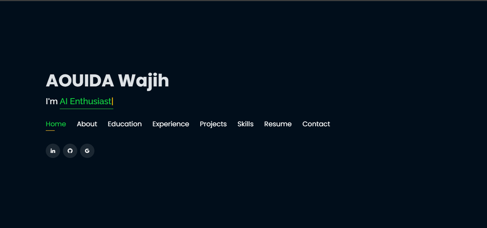
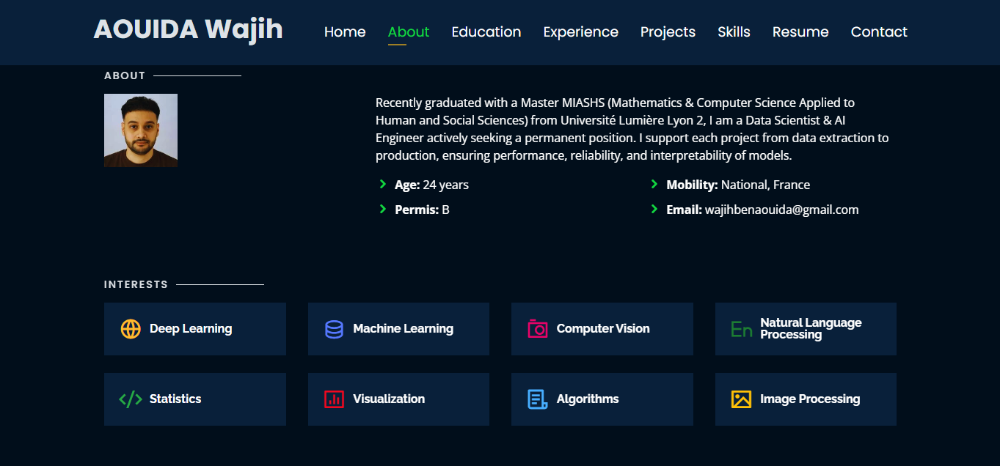
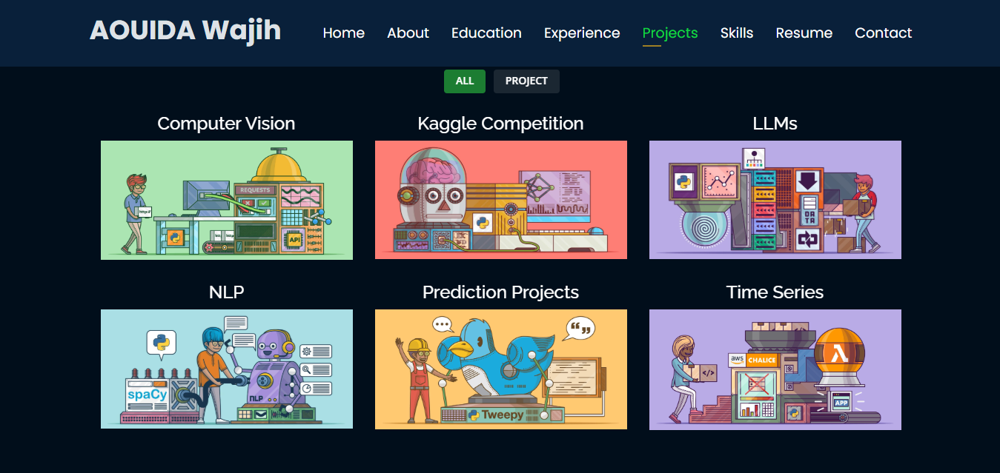

# Personal Portfolio 🔥
Je suis Aouida Wajih, étudiant en M2 MIASHS, passionné par la data science, l’intelligence artificielle et le développement web. Ce site est mon portfolio personnel que j’ai conçu pour présenter mes compétences, mes projets et mon parcours.
> https://wajihaouida.github.io/

### Website Preview
#### Home Page

#### About Page

#### Projects Page

  

## Sections 📚
✔️ About\
✔️ Interests\
✔️ Education\
✔️ Online Certification\
✔️ Experience\
✔️ Projects \
✔️ Skills \
✔️ Resume\
✔️ Contact Info

## Tools Used 🛠️
* <b>GitHub Pages</b> - To host my static website (HTML, CSS, JS).

## License

- **[MIT license](http://opensource.org/licenses/mit-license.php)**
